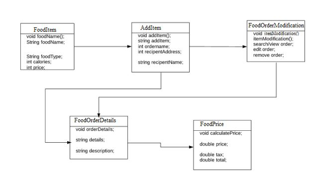

# Food-ordering-System
Project description

This Project is about Food Ordering System. Consumers can select items from the wide selection. It is likely that the products are included in the basket, which can be analyzed and selected at the time of publication. Items purchased can also be deleted. The possibility is that the client pays the claim individually for the things he requests, with this method this application can be quickly integrated with any active software.

Back-end classes

  There are two backend classes. One is customer.cs and other one is manager.cs.
•	In customer.cs where all order will be placed in separate created document where all customer order have a detail of items. 
•	And in manager.cs all calculation perform like giving price of item and make calculation include tax.

UML Diagram:
 

Operations:
Customer will modify items by using option called insert, update, delete. If customer want to see description, then select the item and see the details. Customer have choice to add item to a cart and then it will see the overall details like item name and other description on items. At last, user will see the item price including tax.
